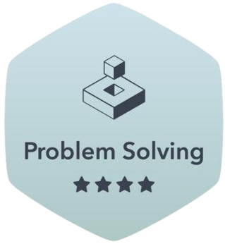
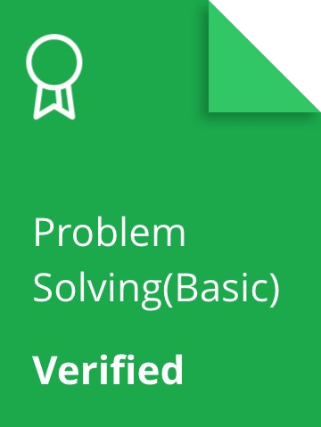
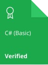

### Olá, meu nome é Matheus Szoke.
- 🌎 Bem vindo ao meu perfil Github!
- 🖥️ Estudando atualmente <strong>Python</strong>/<strong>AI Generative</strong>/<strong>Machine Learning/Deep Learning</strong>.
- 📚 Formado em <strong>Análise e Desenvolvimento de Sistemas</strong>.

### Tecnologias: 

### Bancos de dados: 

### Ferramentas: 

 &nbsp; 

> [!IMPORTANT]
> # Acompanhe-me também no **HackerRank**
> <a href="https://www.hackerrank.com/profile/matheusszoke" target="_blank">Hacker rank profile</a>
>
> ## Badges HackerRank
>
> 
> 
>
> ## Certificados HackerRank
>
> 
> 
> 
